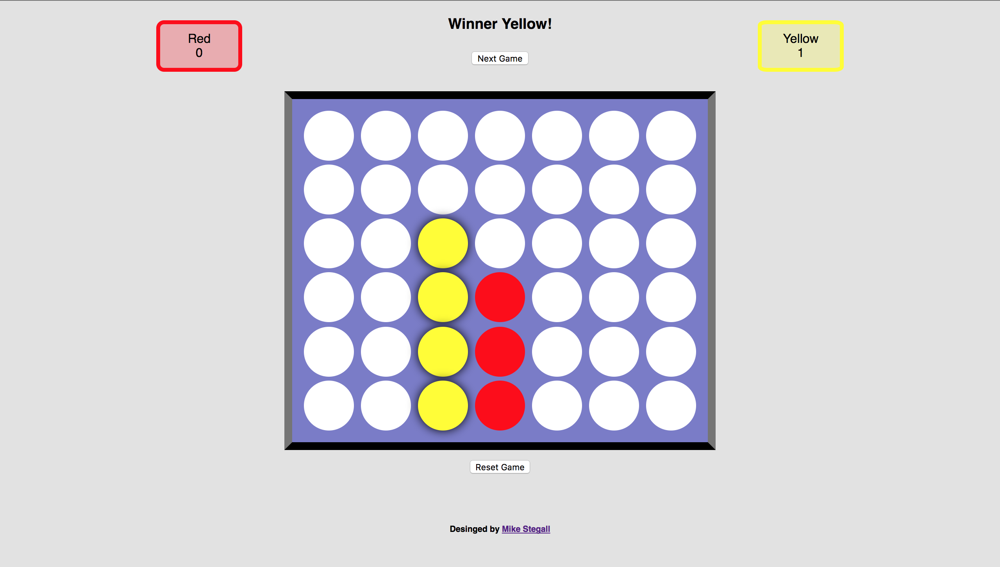

# Connect Four

[](https://travis-ci.org/MikeStegall/connect-four)


[Play it now!]

> Build the classic game [Connect Four] using JavaScript and React.js.



## Challenges
Some of the challenges with this project would being about to drop a single piece into the board and have it go through the whole column of the board. You have to figure out which way your board is facing in order to do that. In order to figure that out you need to ***console.table()*** to see how the table is laid out. Everyones table will be laid out differently. Local Storage was another hurdle that had to be crossed as well. It needed to keep the state of the game even if the browser was refreshed.


## Tech Used

Built with:
* React (functional stateless components)
* CSS
* ES6 with Babel
* [Connect Four Lib]

## Development Setup

```sh
# In the project directory, you can run:

npm start

# Runs the app in the development mode.
# Open http://localhost:3000 to view it in the browser.

# The page will reload if you make edits.
# You will also see any lint errors in the console.

npm run build

# Builds the app for production to the build folder.
# It correctly bundles React in production mode and optimizes the build for the best performance.

# The build is minified and the filenames include the hashes.
# Your app is ready to be deployed!
```

## Credit
[Mike Stegall]


[Connect Four]:https://en.wikipedia.org/wiki/Connect_Four
[React]:https://facebook.github.io/react/
[functional, stateless components]:https://facebook.github.io/react/docs/components-and-props.html#props-are-read-only
[localStorage]:https://developer.mozilla.org/en-US/docs/Web/API/Window/localStorage
[Play it now!]:http://connect-four-app.surge.sh/
[Connect Four Lib]:https://www.npmjs.com/package/connect-four-lib
[Mike Stegall]: https://github.com/MikeStegall
